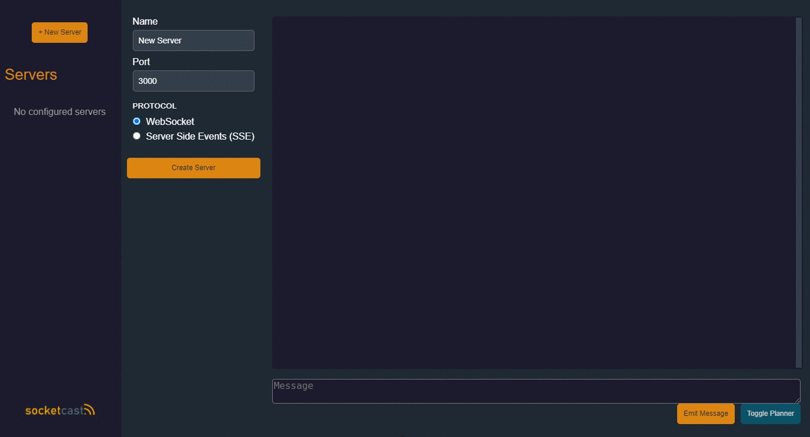
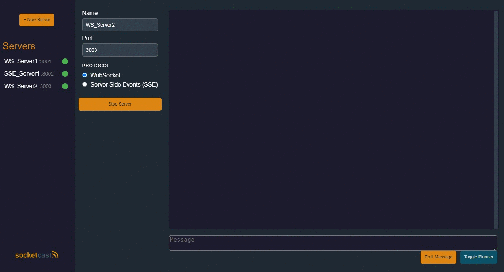
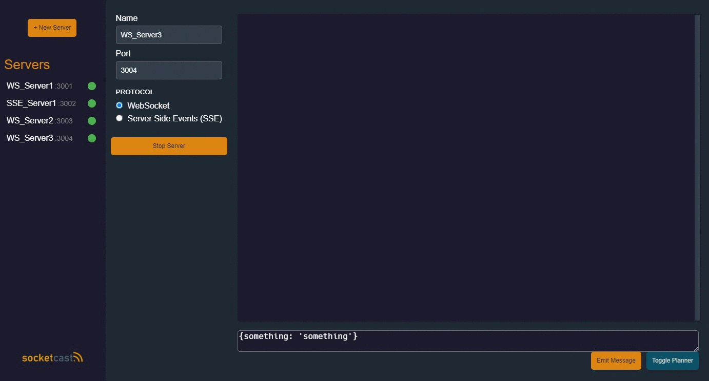
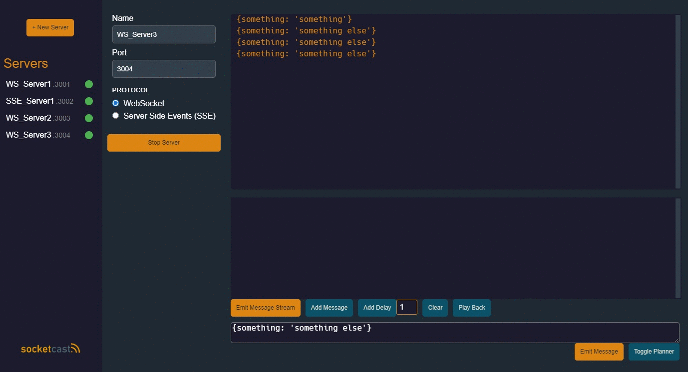

  
  
   

## Motivation
Developers working on real-time data applications and services may need to rapidly test their client applications with WebSocket servers. socketcast allows developers to stub their responses in a WebSocket server.

## Features
* Configure and launch multiple WebSocket servers
* Send improvised responses to clients
* Plan out responses with delays to send back to clients 

## Getting Started

## Create Servers

## Emit Messages

## Create and Emit Stream

## Stop, Start and Remove Servers

## Development
### Built With
* Electron
* TypeScript
* react
* redux-thunk

### Client
socketcast is an Electron cross platform desktop app. It is built with React.

### ServerManager
socketcast has the ability to launch multiple WebSocket servers and it does so through an abstraction called ServerManager. The client application should never manage any servers directly, but instead interact with ServerManager's exposed API through Redux actions. 

## Potential for Improvement
* Expand the protocol selection to Server Sent Events (SSE) and socket.io
* Create the ability to build URL paths for the client application to subscribe selectively to events
* Incorporate authentication
* Design input boxes to validate JSON

## Authors
* Will Bladon [whbladon](https://github.com/whbladon)
* Chris Docuyanan [cjo2](https://github.com/cjo2)
* Chance Hernandez [ItsChance-BTW](https://github.com/ItsChance-BTW)
* Colin Vandergraaf [colinvandergraaf](https://github.com/colinvandergraaf)

## License
