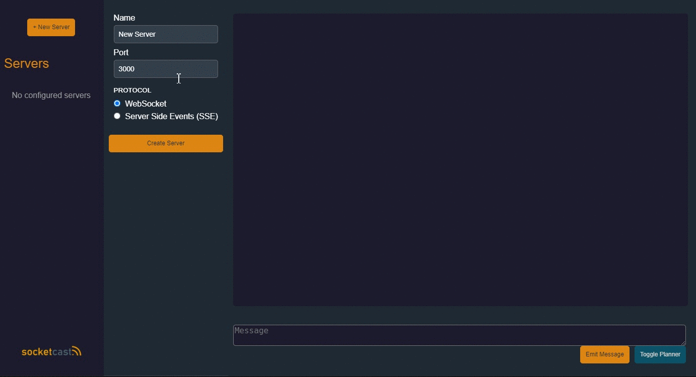
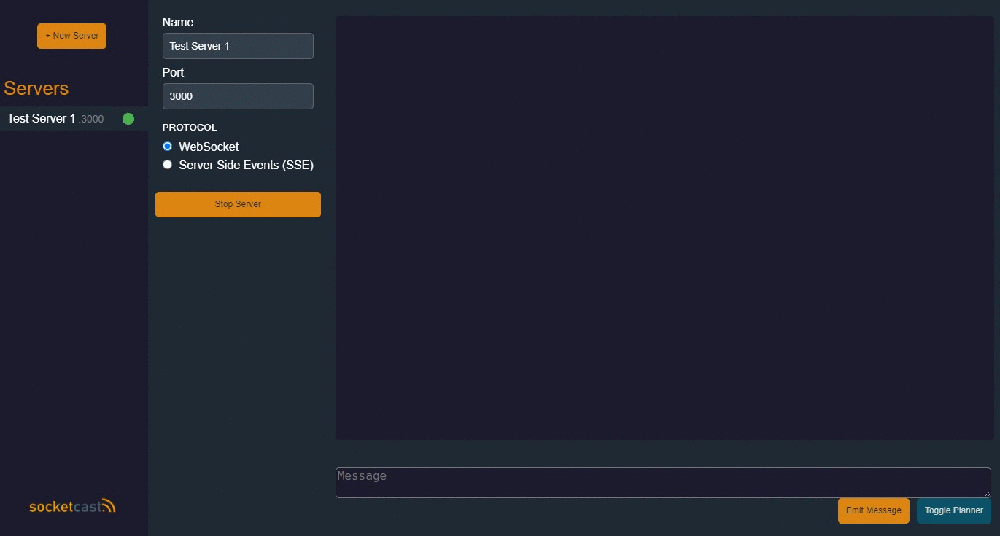
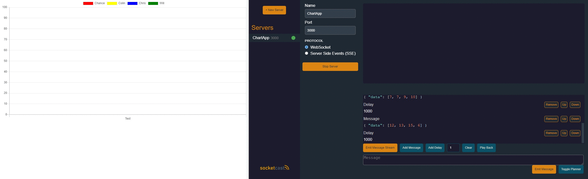

<p align="center">

</p>

<p align="center">
  
  
   
</p>


## Motivation
Developers working on real-time data applications and services may need to rapidly test their client applications with WebSocket or SSE servers. Socketcast provides developers with a tool to configure and run server instances that serve stub websocket and SSE data to connected clients.

## Features
* Configure, launch, and manage multiple WebSocket or SSE servers
* Send data to connected clients
* Plan out a data stream to send connected clients
* Persistent local storage of server configurations

## Getting Started

1. Fork and clone the Socketcast Repo
2. Install node dependencies
```bash
npm i
```
3. Bundle the application
```js
npm run build
```
4. Start the application

```bash
npm start
```

## Create Servers and Configure Server Instances
- Create one or many stub servers to run in parallel to test your application.
- Choose the WebSocket or Server Side Events (SSE) protocol to connect over. 
- Click start server and voila! You have a functioning server to test your application.  



## Send Data
- Insert data into message input
- Emit data!




## Create and send Data Streams to Connected Clients
- Connect a client application by opening a websocket connection to the specified port.
- Open stream planner and construct stream with messages and delays.
- Send the stream!



## Development
### Built With
* Electron
* TypeScript
* React
* Redux
* Redux-thunk
* Websockets
* Jest
* Webpack


### Client
Socketcast is an Electron cross platform desktop app. It is built with React.

### ServerManager
Socketcast has the ability to launch multiple WebSocket servers and it does so through an abstraction called ServerManager. The client application should never manage any servers directly, but instead interact with ServerManager's exposed API through Redux actions. 

## What's next?
* Add support for other protocols such as HTTP2
* Create the ability to build URL paths for the client application to subscribe selectively to events
* Add ability to parse authentication headers
* Log debugging information from client

## Want to contribute?
Socketcast encourages contributions to this product, pull requests are welcome.

Fork the repo and create a working branch from master.
If you've added any code that requires testing, add tests.
Check to ensure that all tests pass.
Make sure code is formatted with prettier and follows the Airbnb React/JSX Style Guide.
Create a pull request to master.

Issues
Please do not hesitate to file issues. Socketcast is based off of community feedback and is always looking for ways to get better. We are interested to hear about your experience and how we can improve Socketcast.


## Authors
* Will Bladon [whbladon](https://github.com/whbladon)
* Chris Docuyanan [cjo2](https://github.com/cjo2)
* Chance Hernandez [ItsChance-BTW](https://github.com/ItsChance-BTW)
* Colin Vandergraaf [colinvandergraaf](https://github.com/colinvandergraaf)

## License
[License](https://github.com/oslabs-beta/socketcast/LICENSE)
